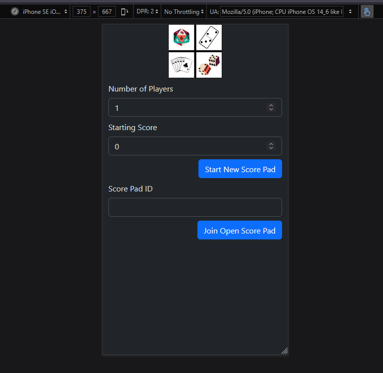
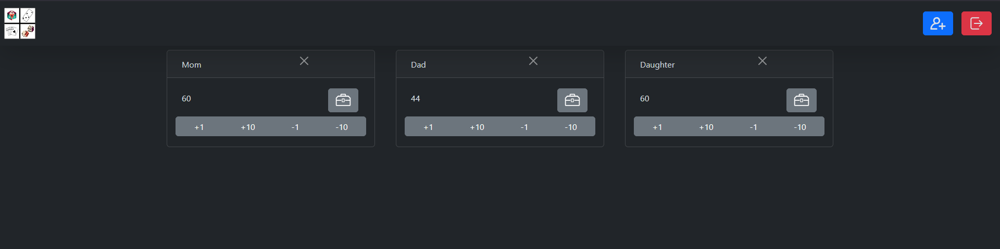
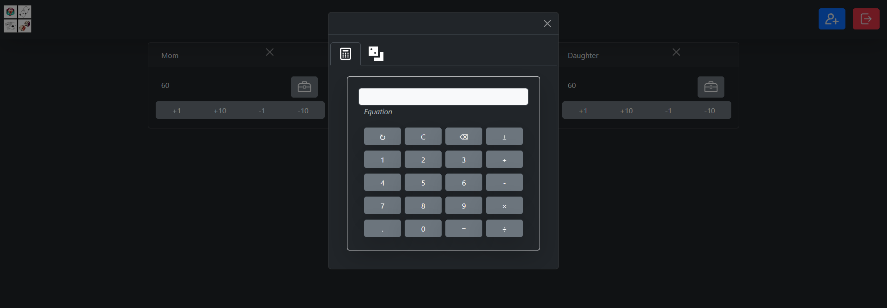

# ScorePad Full-Stack App

A full-stack real-time score tracking application featuring a React front end located in the `/client` directory and an Express + WebSocket server at the root.

---

## Screenshots

Mobile First


Multi-User


Convenient Toolbox


---

## Architecture Overview

- **Backend (`/`)**: Express API & WebSocket server managing room state, client connections, and scorepad updates via the `ScorePads` class.
- **Frontend (`/client`)**: React single-page application built with Context API (`ScorePadProvider`) for state management and real-time UI synchronization based on connection and room ID states.

---

## Tech Stack

- **Frontend**: React, TypeScript, React Context API, CSS
- **Backend**: Node.js, Express.js, WebSockets (`ws`), TypeScript
- **Tooling**: `dotenv`, `cors`

---

## Project Structure

```
├── client/                 # React frontend application
│   └── src/
│       ├── components/     # UI components (Scorepad, NewScorepad, AwaitConnection)
│       ├── contexts/       # React context for WebSocket and ScorePad state
│       ├── App.tsx         # Main application routing view logic
│       ├── main.tsx        # React entry point
│       └── main.css        # Global styling
│
├── class/                  # In-memory ScorePads data model
├── controller/             # WebSocket message router & handlers
├── public/                 # Built client static files hosted by Express
├── index.ts                # Express & WebSocket server entry point
├── globalConstants.ts      # Shared message types & event constants
└── types.ts                # TypeScript interfaces
```

---

## Getting Started

### 1. Installation

Install dependencies for both the root server and the React client:

```bash
# Install root (server) dependencies
npm install

# Install client dependencies
cd client
npm install
```

### 2. Environment Configuration

Create a `.env` file in the root directory:

```env
PORT=3000
NODE_ENV=development
```

### 3. Running Development Servers

Start the backend server and client dev server:

```bash
# Start backend server (root)
npm run dev

# Start frontend dev server (in /client)
cd client
npm run dev
```

---

## Client Routing State Flow

The React app dynamic view rendering depends on the WebSocket state handled by `ScorepadContext`:

1. **`AwaitConnection`**: Shown while the WebSocket connection is establishing.
2. **`NewScorepad`**: Rendered when connected but no active room/scorepad ID is set.
3. **`Scorepad`**: Rendered once connected and joined to a valid scorepad session.

---

## API & WebSocket Reference

### HTTP Endpoints

| Endpoint     | Method | Description                                                |
| :----------- | :----- | :--------------------------------------------------------- |
| `/`          | `GET`  | Serves static client files (`public/index.html`)           |
| `/scorepads` | `GET`  | Returns active `ScorePads` state (_Development mode only_) |

### WebSocket Protocol

- **Endpoint**: `ws://localhost:3000`
- **Connection Handshake**: Server broadcasts `SYSTEM_MESSAGE` upon initial socket connection:
    ```json
    {
        "type": "SYSTEM_MESSAGE",
        "data": { "message": "Successfully Connected" }
    }
    ```
- **Message Dispatching**: All incoming socket messages are forwarded to `websocketMessageHandler` to synchronize room and score state.
